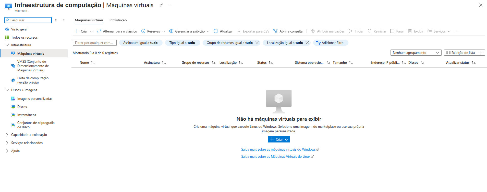
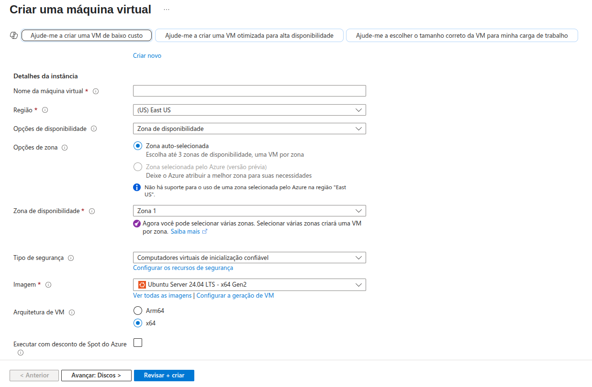

# Microsoft Azure - Máquinas Virtuais

  Por meio do laboratório “Criando Máquinas Virtuais na Azure”, do curso “Bradesco - Java Cloud Native” da DIO, no módulo de Cloud, é possível compreender os aspectos iniciais da utilização do portal Microsoft Azure na criação e configuração de máquinas virtuais(VMs).

  As VMs em nuvem oferecem infraestrutura como serviço (IaaS), permitindo controle total sobre os softwares executados, incluindo a escolha do sistema operacional. É possível executar máquinas virtuais separadas para fins de teste, desenvolvimento ou outras tarefas específicas. Além disso, elas podem ser agrupadas para aumentar a disponibilidade, a escalabilidade e a redundância.

  Ao selecionar o serviço de máquinas virtuais na Azure, o usuário tem acesso a uma interface para supervisionar, criar e configurar VMs. Durante o processo de criação, é possível optar por configurações personalizadas ou predefinidas. Entre as opções de personalização, destacam-se: a definição do nome da máquina virtual, a escolha da região, a seleção de opções de disponibilidade (impactam nos SLAs), além da configuração do nível de segurança. Também é fornecida a possibilidade de escolher a imagem do sistema operacional, o tamanho da máquina (núcleos de CPU e RAM), o tipo de disco de armazenamento e as configurações de rede.

  A Azure permite ainda o agrupamento de máquinas virtuais em conjuntos de dimensionamento ou de disponibilidade. O primeiro permite agrupar VMs idênticas, otimizando o balanceamento de carga e a escalabilidade. Já o segundo distribui as VMs entre domínios de atualização (grupos atualizados em momentos distintos) e domínios de falha (grupos com infraestrutura física separada, como energia e rede), oferecendo maior resiliência e alta disponibilidade.
